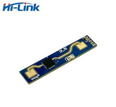
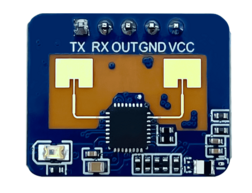
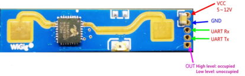

# HLK-LD2410 24GHz mmWave presence sensor

??? failure "This feature is not included in precompiled binaries"  

    When [compiling your build](Compile-your-build) add the following to `user_config_override.h`:
    ```c++
    #ifndef USE_LD2410 
    #define USE_LD2410               
    #endif
    ```




## Configuration
### Wiring


| HLK-LD2410(B,C)  | ESP |
|---|---|
|GND   |GND   
|VCC   | 5V
|TX   | GPIOx
|RX   | GPIOy
|OUT    | GPIOz

!!! Warning "Warning: The power supply voltage of the module is 5V, and the power supply capacity of the input power supply is required to be greater than 200mA.<br>The module IO output level is 3.3V!"

### Tasmota Settings
In the **_Configuration -> Configure Module_** page assign:

- GPIOx to `LD2410 Tx`
- GPIOy to `LD2410 Rx`
- GPIOz to `Switch` or `Button`
